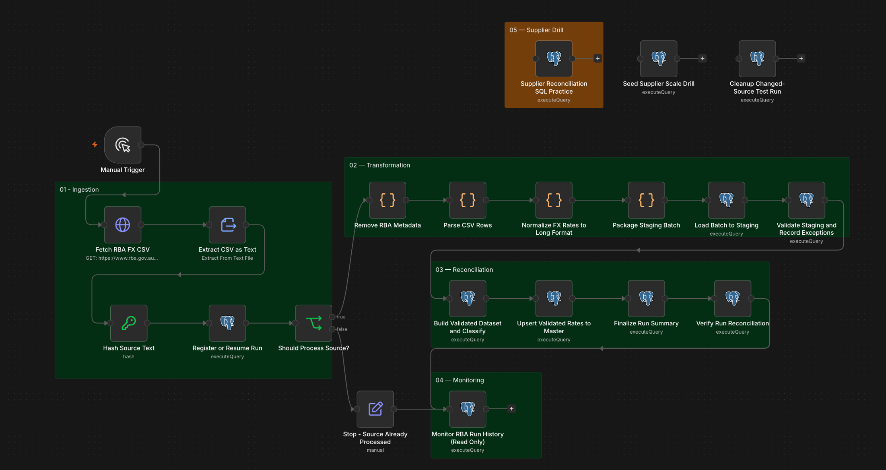
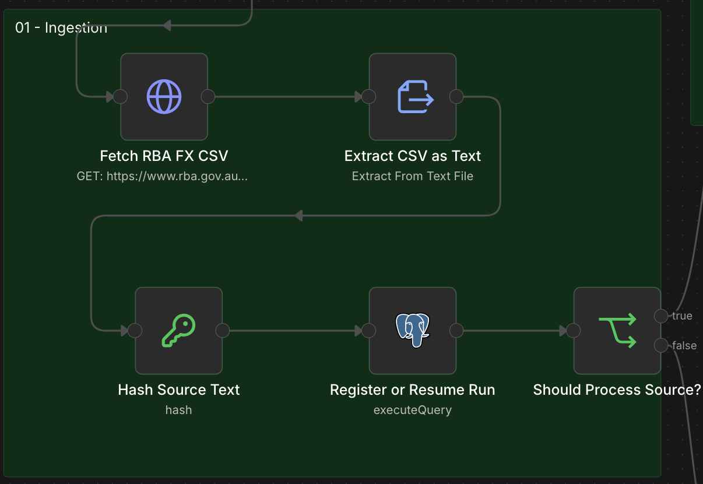
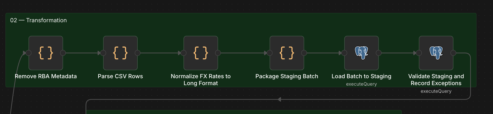
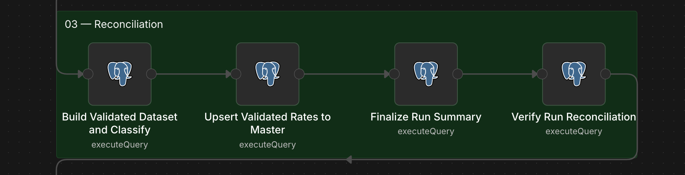
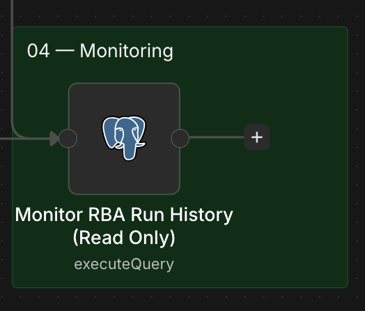
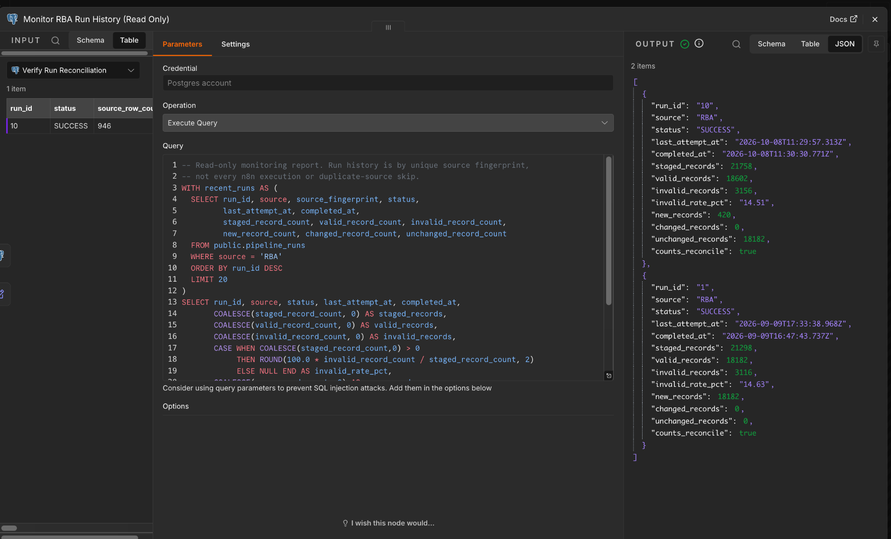
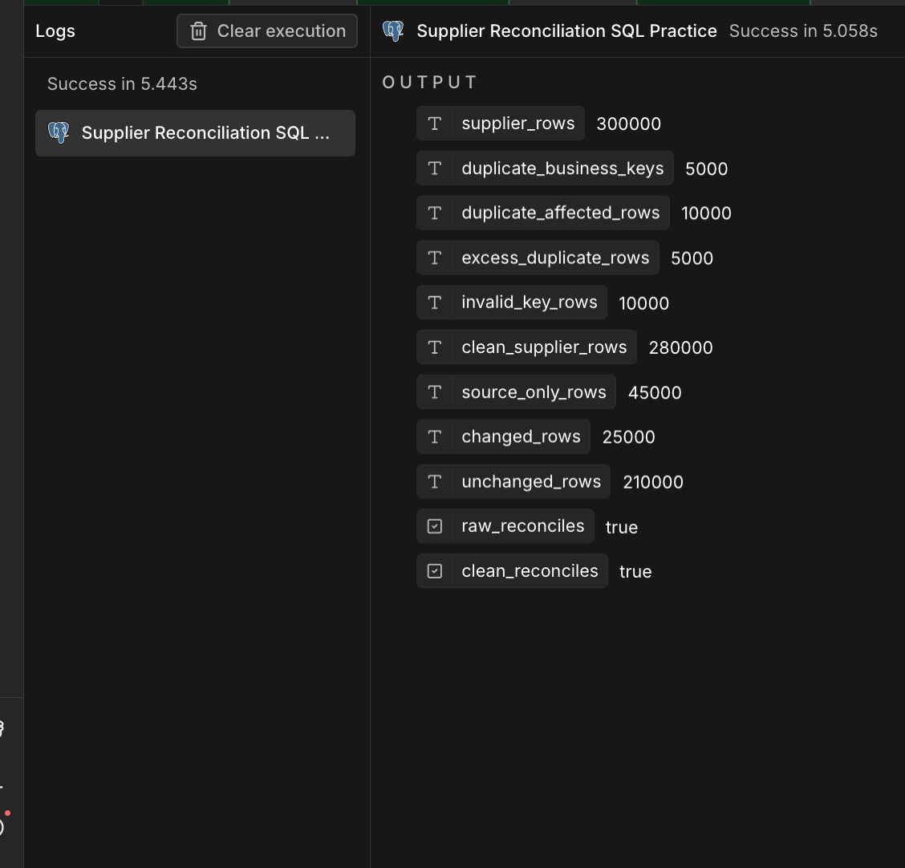

# Financial Data Quality & Reconciliation Pipeline

**n8n · PostgreSQL · SQL · Docker · Databricks · Microsoft Fabric · Azure ADLS Gen2 · Key Vault · PySpark · Delta Lake · RBA public foreign-exchange data**

An end-to-end, ETL-style workflow that fetches Reserve Bank of Australia (RBA) foreign-exchange data, transforms CSV records into a relational staging dataset, validates quality, tracks exceptions, classifies incremental changes and reconciles results against master data. A read-only SQL monitoring node reports historical outcomes.

**Scope:** Personal technical project and synthetic-data exercise; includes a Databricks Free Edition reimplementation, not an enterprise production deployment.

## Verified results

| Measure | RBA run #1 · 9 Sep 2026 | RBA run #10 · 8 Oct 2026 |
|---|---:|---:|
| Staged records | 21,298 | 21,758 |
| Valid records | 18,182 | 18,602 |
| Invalid records | 3,116 | 3,156 |
| Invalid rate | 14.63% | 14.51% |
| NEW | 18,182 | 420 |
| CHANGED | 0 | 0 |
| UNCHANGED | 0 | 18,182 |
| Count reconciliation | **PASS** | **PASS** |
| Status | SUCCESS | SUCCESS |

**Incremental processing:** run #10 identified 18,182 existing valid records as unchanged and 420 additional valid records as new. The two displayed runs do **not** by themselves validate an updated-rate CHANGED case. A changed-source test/cleanup utility exists but is separate from the main pipeline.

### Synthetic supplier reconciliation drill

A standalone PostgreSQL SQL node in the same n8n project was re-executed successfully against **300,000 synthetic supplier rows** (query execution shown as ~5.06 seconds, excluding dataset generation and end-to-end ETL).

| Metric | Verified output |
|---|---:|
| Supplier rows | 300,000 |
| Duplicate business keys | 5,000 |
| Duplicate-affected rows | 10,000 |
| Invalid key rows | 10,000 |
| Clean supplier rows | 280,000 |
| SOURCE_ONLY | 45,000 |
| CHANGED | 25,000 |
| UNCHANGED | 210,000 |
| Raw reconciliation | **true** |
| Clean reconciliation | **true** |

Reconciliation checks: `300,000 = 10,000 + 10,000 + 280,000` and `280,000 = 45,000 + 25,000 + 210,000`.

These are deterministic synthetic data and SQL classification/reconciliation results. They are not evidence of Spark, distributed Big Data processing or production throughput.



## Databricks medallion implementation (9 Oct 2026)

A separate [Databricks notebook](databricks/RBA_FX_Medallion_Pipeline.ipynb) reimplements the same RBA FX source and core n8n transformations with **Python, PySpark, Spark SQL, and Delta Lake**. The implementation is kept alongside the [original n8n workflow](workflows/rba-fx-data-quality-pipeline.json), not presented as a separate unrelated project.

- **Bronze:** fetch the public RBA F11.1 CSV, calculate a SHA-256 fingerprint, and save source lines to Delta.
- **Silver:** remove metadata, parse observations, normalize 23 FX series from wide to long, stage records, and apply the original ten quality rules; store exception details in Delta.
- **Gold / reconciliation:** classify valid rows as NEW / CHANGED / UNCHANGED against the master business key (`source, rate_date, series_id`); use Delta `MERGE INTO` for conditional updates; record reconciliation outcomes and query run history.
- **Source-run protection:** run registry with RUNNING and SUCCESS states and duplicate-source fingerprint detection. Full orchestration, automatic recovery from FAILED runs, and enterprise scheduling are out of scope.

**Observed Databricks Free Edition result (9 Oct 2026):** 21,781 staged rows; 18,623 valid; 3,158 invalid (14.50%). First-load classification: 18,623 NEW / 0 CHANGED / 0 UNCHANGED. Count reconciliation and master key/value checks passed; one SUCCESS run was persisted. A repeated identical fingerprint was detected and the notebook exit path returned SKIPPED. A CHANGED/Delta MERGE test was performed independently with synthetic modified values; these are not real-world changed-rate observations.

The [separate regression notebook](databricks/tests/regression_tests.ipynb) requires existing Delta tables from the main notebook; it deliberately uses an isolated `rba_fx_v2_changed_test` Delta table for the changed-rate scenario. It does not contain automatic destructive reset operations. GitHub Actions validates notebook JSON and Python syntax **only**; it does not connect to Databricks or validate data processing in the cloud.

**Reproduction:** Import the main notebook into Databricks Free Edition with Serverless compute and permissions to create tables in the `default` schema. Run it on a fresh `rba_fx_v2_*` table namespace. Reprocessing identical source content is designed to skip after the fingerprint check; cleanup of test tables should be performed explicitly and separately if a clean first-load demonstration is needed. The source CSV changes over time, so fresh run counts may differ.

## Azure ADLS Gen2 + Microsoft Fabric extension (9 Oct 2026)

The same RBA FX pipeline was adapted and successfully run on **Microsoft Fabric Trial** with PySpark and Delta Lake: 21,781 staged, 18,623 valid, 3,158 invalid; Delta MERGE and reconciliations PASS, run registry SUCCESS, historical monitoring PASS.

An **Azure ADLS Gen2** storage account was provisioned using Standard/LRS and hierarchical namespace, with the original RBA CSV in a private `rba-data/landing` directory. A local [Python SDK verification script](azure/adls_keyvault_verify.py) used Microsoft Entra login to read a short-lived SAS token securely from **Azure Key Vault**, then read the 140,796-byte RBA CSV and write/read back a small proof file; observed terminal result `MVP RESULT: PASS`.

A **Fabric OneLake Shortcut** to the ADLS `landing` folder was created using **Organizational account (OAuth 2.0)**. A standalone Fabric PySpark test read it successfully (`ADLS Shortcut read: PASS`, 2,185 CSV source lines). **The full Fabric Steps 01–13 Pipeline was subsequently rerun using the ADLS OneLake Shortcut as its actual ingestion source**, with a separate Run Registry source identifier: `onelake-shortcut://rba_fx_lakehouse/Files/landing/f11.1-data.csv`. This ADLS-origin run ended `SUCCESS`: 21,781 staged, 18,623 valid, 3,158 invalid, **0 NEW / 0 CHANGED / 18,623 UNCHANGED**, count reconciliation `PASS`. The previously loaded HTTP-origin run remained `SUCCESS` with 18,623 NEW; both runs share fingerprint prefix `bde5871c75c1`. The existing master records were reused rather than duplicated. Fabric SAS + Key Vault Reference shortcut attempts encountered credential retrieval errors and are **not** claimed successful.

[Fabric notebooks, Azure script, reproduction notes, security and scope boundaries](fabric/README.md) · [Fabric 13-step source notebook](fabric/RBA_FX_Fabric_Medallion_MVP.ipynb) · [ADLS Shortcut verification notebook](fabric/verify_adls_shortcut.ipynb)

## Workflow architecture

```text
RBA CSV (HTTP)
    ↓
Extract CSV text → SHA fingerprint → register / resume run
    ↓                                 └─ already processed → stop
Strip metadata → Parse CSV → Normalize wide-to-long
    ↓
Package batch → PostgreSQL staging
    ↓
SQL data validation → exception records
    ↓
Validated dataset → NEW / CHANGED / UNCHANGED
    ↓
Conditional upsert to master
    ↓
Run summary → reconciliation checks

Read-only run monitoring: pipeline_runs → status, counts and invalid-rate history
Separate synthetic practice: seed 250k master / 300k supplier → SQL reconciliation
```

## Functional components

### 01 — Ingestion and source control



- Retrieve the public RBA foreign-exchange CSV.
- Fingerprint the source contents and record processing state in `pipeline_runs`.
- Skip reprocessing of an already successful source fingerprint and support resuming incomplete source runs.

### 02 — Transformation and data quality



- Remove RBA metadata, parse CSV rows, normalize series into long-form records.
- Insert into PostgreSQL `fx_rates_staging`.
- Validate dates, series IDs, rates, non-finite values and duplicated business keys.
- Record quality issues in `dq_exceptions` instead of silently discarding records.

### 03 — Reconciliation and controlled load



- Classify valid records as NEW, CHANGED or UNCHANGED relative to `fx_rates_master`.
- Write only NEW/CHANGED candidates with conditional SQL upsert.
- Store run-level counters and check reconciliations and key uniqueness.

### 04 — Historical monitoring





- Query persisted PostgreSQL `pipeline_runs` for the most recent RBA runs.
- Report status, staging/valid/invalid counts, invalid percentages and load classification.
- Verify `staged = valid + invalid` per run.
- Read-only: it does not rerun the ETL or write data.
- Monitoring reports one row per registered source fingerprint; it is **not** an exhaustive n8n execution-attempt log or a failure alerting system.

### 05 — Supplier-scale SQL drill



- Generate a repeatable **synthetic** 250,000-record reference/master set and 300,000-record source set.
- Detect repeated business keys and invalid keys.
- Reconcile clean records into SOURCE_ONLY / CHANGED / UNCHANGED categories.
- This is a **standalone practice node**, not part of the main automated RBA ingestion path.

## Files

- [Public-safe n8n workflow](workflows/rba-fx-data-quality-pipeline.json) — retains embedded SQL; credentials/instance metadata removed.
- [SQL files](sql/) — individual SQL queries extracted from the workflow for code review.
- [Monitoring SQL](sql/monitor-rba-run-history-read-only.sql) — historical result query.
- [Validation notes](docs/validation-results.md) — supplied run results and scope of verification.

## Setup and safety

1. Provision PostgreSQL with the project-specific tables and constraints: `pipeline_runs`, `fx_rates_staging`, `dq_exceptions`, `fx_rates_validated` and `fx_rates_master`.
2. Import the workflow JSON into n8n; configure your **own** PostgreSQL credentials.
3. The SQL files are reference copies of the embedded node queries. Some use n8n-supplied placeholders (`$1`, `$2`, etc.) and are **not** standalone schema-migration scripts.
4. The supplier seed and changed-source cleanup nodes are intentionally **disabled** in this public export. Review carefully before manually enabling: they contain bulk INSERT/DELETE/UPDATE statements.
5. Avoid running the full workflow against a real database without schema setup, backups and environment checks.

The export documents the implementation, but does not include Docker Compose, complete schema DDL, secrets or a turn-key database deployment.

## Limitations

- The RBA pipeline processes a public CSV file, not private banking/customer data.
- The synthetic supplier drill is SQL on PostgreSQL, not distributed big-data infrastructure.
- Run history reflects distinct registered source fingerprints, not every n8n execution attempt.
- Databricks Free Edition, Fabric Trial, Azure ADLS Gen2 and Key Vault personal-project exercises described above were verified within the explicitly stated scopes; no production infrastructure or SLAs are claimed.
- Test outputs above were supplied from actual node executions; the public export has not been independently executed as a clean-room installation.
